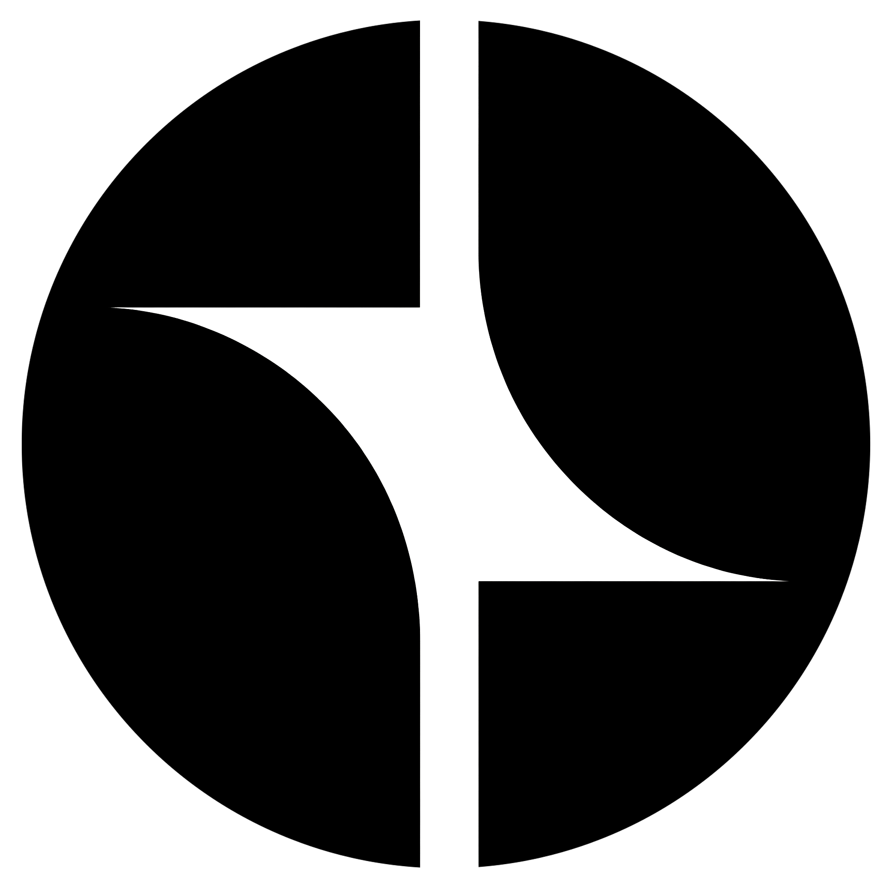
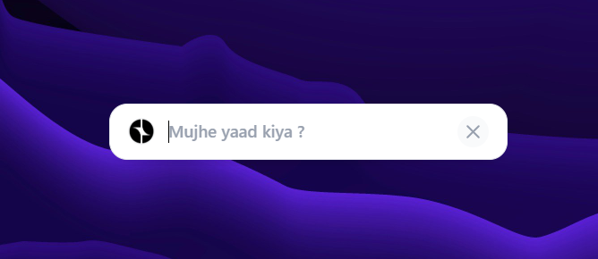
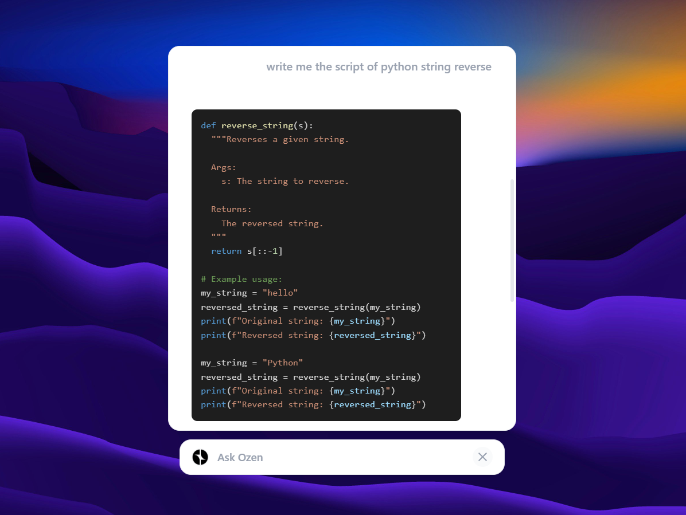
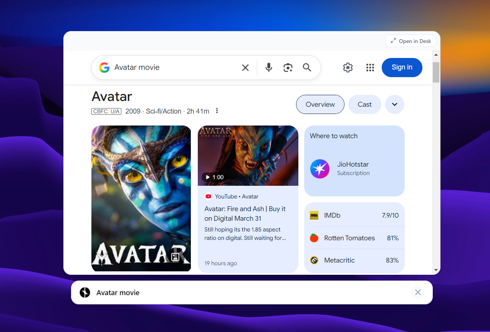
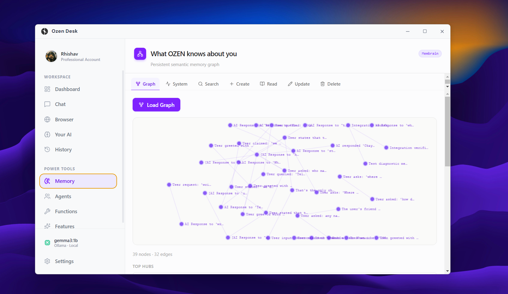

<div align="center">
  
  <h1>Ozen</h1>
  <p><strong>The Near-Invisible OS Layer for Local Intelligence</strong></p>

  [](https://github.com/Rhishavhere/ozen)
  [](https://www.electronjs.org/)
  [](https://react.dev/)
  [](https://tailwindcss.com/)
  [](https://ollama.com/)
</div>

<div align="center">
  

  | | | |
  |:---:|:---:|:---:|
  |  |  |  |
</div>


## 🌊 Rethinking Interaction

There is a cognitive gap between **Action** and **Knowledge**. Today, using AI requires you to break your flow: leave your code, open a browser, switch tabs, and copy-paste.

**Ozen kills this gap.**

Ozen is not an app you "go to." It is a fluid layer that lives exactly where your cursor is. It appears when summoned, provides intelligence instantly, and vanishes without a trace, returning you to your work with zero friction.


## ✨ Key Pillars

### 📍 Contextual Presence
Summon the AI Panel anywhere by typing `@ozen`. The interface spawns exactly at your cursor position. No window switching, no focus loss from your primary task.



### 💨 Zero-Friction Dismissal
Press `Esc` to instantly hide the panel. Ozen uses a "minimize-then-hide" orchestration to ensure focus is returned precisely to the application you were using before. 

### 🔮 The Orb
A minimalist, ambient status indicator that tracks your cursor. It provides a subtle visual signal that Ozen is ready to assist, then auto-fades into the background.

### 🏠 Local-First & Private
Powered by [Ollama](https://ollama.com/) running `gemma3:1b` locally on your machine. Your data never leaves your OS. It’s fast, private, and works offline.




## 🛠️ The "Magic" Interaction

### 1. The `@ozen` Trigger
Type `@ozen` in any text field or application. Ozen detects this sequence globally and spawns the input bar right under your cursor.

### 2. Selection Flow
Select any text and press `Shift + Enter`. Ozen captures the selection, opens the panel, and prepares to process the context immediately.

### 3. Upward Expansion
The panel starts as a minimalist input bar. Upon query, it "zoops" upward into a full chat module, preserving your vertical context.




## 🏗️ Architecture

Ozen leverages Electron's multi-window capabilities to run three concurrent processes:

| Window | Purpose | Route |
|---|---|---|
| **The Orb** | Ambient status & tracking | `/#/orb` |
| **The Panel** | Floating AI interaction layer | `/#/panel` |
| **The Hub** | Main management, history & settings | `/` |




## 🚀 Getting Started

### Prerequisites

### Installation
1. Clone the repository:
   ```bash
   git clone https://github.com/Rhishavhere/ozen.git
   cd ozen
   ```
2. Install dependencies:
   ```bash
   npm install
   ```
3. Start development:
   ```bash
   npm run dev
   ```

### Building for Production
```bash
npm run build
```


## ⚖️ License & Credits

Built with ❤️ by [Rhishavhere](https://github.com/Rhishavhere).
Licensed under the [MIT License](LICENSE).
=======
>>>>>>> origin/main
<div align="center">
   
   <h1>Ozen</h1>
   <p><strong>The Near-Invisible OS Layer for Local Intelligence</strong></p>

   [](https://github.com/Rhishavhere/ozen)
   [](https://www.electronjs.org/)
   [](https://react.dev/)
   [](https://tailwindcss.com/)
   [](https://ollama.com/)
</div>

<div align="center">
  

   | | | |
   |:---:|:---:|:---:|
   |  |  |  |
</div>

---

## 🌊 Rethinking Interaction

There is a cognitive gap between **Action** and **Knowledge**. Today, using AI requires you to break your flow: leave your code, open a browser, switch tabs, and copy-paste.

**Ozen kills this gap.**

Ozen is not an app you "go to." It is a fluid layer that lives exactly where your cursor is. It appears when summoned, provides intelligence instantly, and vanishes without a trace, returning you to your work with zero friction.

---

## ✨ Key Pillars

### 📍 Contextual Presence
Summon the AI Panel anywhere by typing `@ozen`. The interface spawns exactly at your cursor position. No window switching, no focus loss from your primary task.


### 💨 Zero-Friction Dismissal
Press `Esc` to instantly hide the panel. Ozen uses a "minimize-then-hide" orchestration to ensure focus is returned precisely to the application you were using before. 

### 🔮 The Orb
A minimalist, ambient status indicator that tracks your cursor. It provides a subtle visual signal that Ozen is ready to assist, then auto-fades into the background.

### 🏠 Local-First & Private
Powered by [Ollama](https://ollama.com/) running `gemma3:1b` locally on your machine. Your data never leaves your OS. It’s fast, private, and works offline.


---

## 🛠️ The "Magic" Interaction

### 1. The `@ozen` Trigger
Type `@ozen` in any text field or application. Ozen detects this sequence globally and spawns the input bar right under your cursor.

### 2. Selection Flow
Select any text and press `Shift + Enter`. Ozen captures the selection, opens the panel, and prepares to process the context immediately.

### 3. Upward Expansion
The panel starts as a minimalist input bar. Upon query, it "zoops" upward into a full chat module, preserving your vertical context.


---

## 🏗️ Architecture

Ozen leverages Electron's multi-window capabilities to run three concurrent processes:

| Window | Purpose | Route |
|---|---|---|
| **The Orb** | Ambient status & tracking | `/#/orb` |
| **The Panel** | Floating AI interaction layer | `/#/panel` |
| **The Hub** | Main management, history & settings | `/` |


---

## 🚀 Getting Started

### Prerequisites
- **Node.js** (v18+)
- **Ollama** (Ensure `ollama serve` is available or the app will attempt to start it)

### Installation
1. Clone the repository:
    ```bash
    git clone https://github.com/Rhishavhere/ozen.git
    cd ozen
    ```
2. Install dependencies:
    ```bash
    npm install
    ```
3. Start development:
    ```bash
    npm run dev
    ```

### Building for Production
```bash
npm run build
```


## ⚖️ License & Credits

Built with ❤️ by [Rhishavhere](https://github.com/Rhishavhere).
Licensed under the [MIT License](LICENSE).
